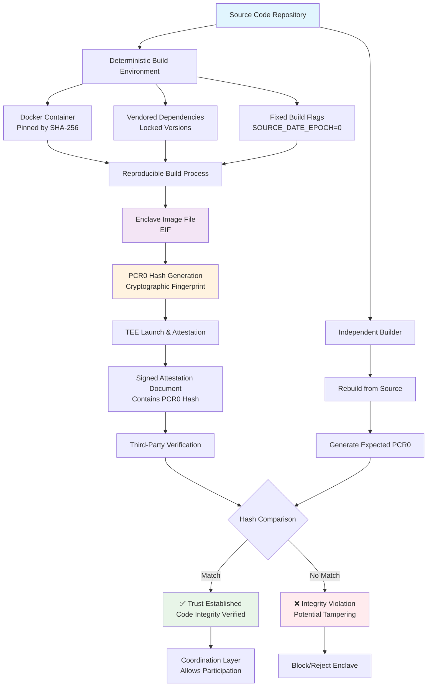

# Silvana TEE Reproducible Build Feature

## Introduction

Silvana's platform leverages Trusted Execution Environments (TEEs) to run critical operations in isolated, secure enclaves. A cornerstone of this design is Silvana's reproducible build process for TEE code. In simple terms, reproducible builds mean that anyone can build the enclave software from source and get bit-for-bit identical outputs. This ensures that the code running inside Silvana's enclaves is exactly what it's supposed to be – with no hidden modifications – and that this can be verified independently. By making TEE builds deterministic and transparent, Silvana instills a high degree of trust in its secure enclaves for users, partners, and regulators.

## Reproducible Build Process Overview

## Understanding Reproducible Builds

In traditional software builds, compiling the same source code on different machines or at different times can yield slightly different binaries (due to timestamps, environment differences, etc.). Reproducible builds eliminate these variations. They guarantee that given the same source code and build instructions, the resulting binary will always be identical no matter who builds it or when. This is achieved by removing nondeterministic elements from the build process. The benefit is verifiability: anyone can rebuild the software and match it against an official release to confirm nothing was tampered with. In the context of Silvana's TEEs, reproducible builds allow the enclave's binary "fingerprint" to be known in advance and publicly verified.

## Silvana's Deterministic Enclave Build Process

For Silvana's TEE platform, achieving reproducible builds requires careful control over every input to the build. The team has implemented a number of measures to make the enclave build fully deterministic:

### Hermetic, Pinned Build Environment

The entire compiler and OS environment used to build enclaves is fixed and unchanging. Silvana uses Docker container images for building the enclave, and each base image is pinned by its SHA-256 digest (content hash) rather than a floating version tag. For example, the Rust compiler image and Linux base image are referenced with specific digests so that the exact same toolchain and libraries are used on every build. In the x86 build pipeline, Silvana even employs the StageX toolchain – a set of containerized build tools that are fully source-bootstrapped and deterministic – all pinned by hash for a hermetic compiler environment. This ensures no divergence in the build environment over time.

### Vendored & Locked Dependencies

All code dependencies are vendored or pinned to exact versions. The Rust crate dependencies for Silvana's enclave software are included with the source or locked via a Cargo.lock, so that the build does not fetch anything unpredictable from the internet. External components such as AWS Nitro Enclaves tools are pulled at specific commit hashes. For instance, the build script fixes the AWS Nitro Enclaves CLI source to a particular Git commit before compiling it. By using exact commit IDs and checksum-verified sources for every library or tool, Silvana guarantees that the input code is always identical. There's no "floating" dependency version that could introduce indeterminism – every component is a known quantity.

### Deterministic Build Flags and Environment

Silvana's build process sets special flags to remove timestamp and randomness from compilation. For example, the environment variable `SOURCE_DATE_EPOCH` is set to a constant (such as 0) so that any date or time in the build is fixed. The Rust compiler is instructed not to include build IDs in outputs (`-C link-arg=-Wl,--build-id=none`) and to disable incremental compilation (via `CARGO_INCREMENTAL=0`). These measures prevent the compiler from inserting unique IDs or cache-related data that could vary between builds. The result is that two builds of the enclave code produce the exact same binaries, down to every byte, because things like embedded timestamps or random IDs have been eliminated.

### Deterministic Filesystem Image Construction

Beyond compiling the enclave binaries deterministically, Silvana also constructs the enclave's filesystem image in a reproducible way. The enclave runs with a minimal initramfs (RAM filesystem) that bundles the application binaries and necessary files. Silvana's build scripts explicitly control the creation of this initramfs archive. All files that go into the enclave image are first given a fixed timestamp (e.g. zeroed out to January 1970) and sorted in a consistent order before packaging. For example, the build uses commands to touch every file with the same timestamp and sort the file list prior to archiving. Then it uses GNU cpio in reproducible mode (`--reproducible`) to create the archive, and compresses it with gzip using options that omit timestamps. This means the resulting enclave disk image (which is basically a gzipped cpio archive in the Nitro Enclave format) will be exactly the same on every build. Even the ordering of files inside and their metadata are identical, removing another source of potential difference.

### Cross-Architecture Support (x86_64 and ARM64)

Silvana has engineered this reproducible build process to work on both major server architectures. Whether the enclave is targeting a standard Intel/AMD x86_64 processor or an ARM64 processor (like AWS Graviton instances), the build is deterministic. The specifics differ slightly (for instance, using Alpine Linux with musl for ARM enclaves vs. StageX toolchain for x86), but in both cases the outputs are consistent across time and systems. The reproducible TEE images are built for each architecture with the same philosophy – pinned compilers and OS, identical dependency versions, and deterministic packaging. This enables Silvana's platform to support multiple hardware environments without sacrificing the verifiability of the enclave code. An enclave built for ARM will have a known hash, and the same enclave code built for x86 will have its own known hash – both can be independently verified in their respective domains.

By enforcing all the above, Silvana ensures that building the TEE image is like a pure function: given the same source, it always produces the same output. There is no dependency on the whim of external servers or the clock; everything is under version control and fixed inputs.

## Enclave Integrity Verification via PCR0 Hashes

One of the main reasons this reproducible build feature is so powerful is because it allows cryptographic verification of enclave integrity. In modern TEEs such as AWS Nitro Enclaves (which Silvana utilizes), the system computes a set of hash measurements of the enclave's contents during the build/launch process. The most significant of these is often referred to as PCR0 (Platform Configuration Register 0) – which is essentially the hash of the entire enclave image file (EIF). In simpler terms, PCR0 is a unique fingerprint of the enclave's code and filesystem.

When an enclave is launched, the Nitro hypervisor or TEE platform will generate this PCR0 measurement and include it in a signed attestation document. Silvana's enclaves can present this attestation to any external party, and it effectively proves "This enclave is running code with hash XYZ." Because Silvana's build process is reproducible, we already know what hash XYZ should be for the official source code. The same code built deterministically always yields the same PCR0 hash.

This means that anyone can verify the enclave's integrity: a third party can independently build Silvana's enclave code from the published source and confirm that the hash of their build matches the PCR0 reported in the enclave's attestation. If it matches, it cryptographically guarantees the enclave is running exactly the intended code, with no alterations. If even a single byte were different – due to malicious tampering or a build discrepancy – the hash would not match, and the discrepancy would be immediately evident.

In practice, Silvana can publish the expected PCR0 hash for each enclave version. Users or other services interacting with the enclave can check attestation documents against this expected value to gain trust in the enclave. The attestation process, backed by the cloud provider's signature, proves the enclave is legitimate and running the correct code. Thus, reproducible builds enable Silvana to treat the enclave's hash like a secure ID card – one that any verifier can rely on to be sure of what's inside the black box of the TEE.

## Benefits to the Silvana Platform and Use Cases

The reproducible TEE build feature is not just a technical nicety; it directly supports Silvana's broader platform needs and use cases:

### Provable Agents & Coordination

Silvana's architecture involves many autonomous agents (pieces of business logic, provers, verifiers, etc.) that run across the network, often within enclaves. Because each agent's enclave is reproducibly built and attestable, the platform's Coordination Layer can reliably verify every agent's code before orchestrating it. In other words, agents prove their identity and integrity via enclave hashes, enabling Silvana to coordinate a network of provable agents where each node's trustworthiness is assured. This is critical when multiple parties or services are cooperating – the coordinator and participants can be confident that everyone is running approved code, not a rogue or outdated version.

### Secure Use of Private Data

A major advantage of TEEs is the ability to use sensitive private data without exposing it. Silvana enclaves can ingest confidential data (e.g. a company's financial records or a user's personal information) and perform computations or generate proofs on that data. Reproducible builds amplify the trust in this process: stakeholders know exactly what code is touching the private data. For example, an enclave might be tasked with proving a financial metric from a private database without revealing the raw data. Because the enclave binary is deterministic and verifiable, the data owners and regulators can audit the enclave code and be confident it handles the data appropriately. This capability unlocks privacy-preserving yet verifiable workflows – using private data securely in Silvana's enclaves while still providing cryptographic proof of the outcomes.

### Trusted Off-Chain Execution

Silvana's platform spans both on-chain and off-chain components. Some logic runs on-chain (e.g. smart contracts or coordination contracts), while more complex or data-intensive logic runs off-chain in the Silvana enclaves (for speed, privacy, or scalability reasons). Reproducible enclave builds ensure that off-chain computation is as trustworthy as on-chain code. Normally, off-chain systems introduce a trust gap – how do you know an off-chain service did the right thing? Silvana closes that gap with TEEs and attestation. Since the enclave's code is fixed and known, and its hash can be verified, the results it produces (e.g. a zero-knowledge proof or a state update) carry strong credibility. This means Silvana can execute parts of an application off-chain (in high-performance TEEs) without sacrificing the trust guarantees we expect from on-chain execution. It's a seamless blend of blockchain-level trust with cloud-level performance, enabled by reproducible TEEs.

### Auditability & Compliance

For enterprise users and regulators, one of the biggest concerns with black-box execution is the inability to audit what's happening. Silvana's reproducible TEE feature turns enclaves into fully auditable black boxes. Auditors can be given the source code of the enclave and the expected build hash. They can compile it themselves and mathematically verify that Silvana's running enclaves are identical to that code. This offers unprecedented transparency. Regulators could require that financial algorithms, for instance, run in an enclave with a publicly known hash – so they can always verify compliance by matching the hash and even step through the code logic outside the enclave. Every update to Silvana's enclave software can be audited before deployment, and because the build is deterministic, there's no worry that the audit version differs from the deployed version. This level of continuous auditability builds trust with regulators and enterprise partners that require strict oversight.

### Integration with Silvana's Coordination Layer

Silvana's Coordination Layer (the orchestrator of transactions and proofs in the network) takes full advantage of enclave reproducibility. When a new TEE node or agent joins, the Coordination Layer can automatically perform an attestation check – essentially asking the enclave to prove its hash – and compare it against the expected value. Only if the enclave's measurement is correct will the Coordination Layer permit it to participate in the protocol (for example, to generate or verify proofs, update state, etc.). This automated integrity check is made reliable by reproducible builds; the Coordination Layer knows what hash to expect for a valid node. This mechanism strengthens the network's security by blocking any nodes that don't match the known-good code. It also enables on-the-fly addition of new agents in a decentralized network, since trust can be established immediately via attestation. In summary, reproducible TEEs make Silvana's multi-agent system self-verifying and robust, as every critical component can be checked and trusted at runtime.

## Strategic Value of Reproducible TEE Builds

Silvana's insistence on deterministic, reproducible enclave builds yields significant strategic benefits for the platform:

### Transparency

Both the code and the build process for Silvana's TEEs are transparent and verifiable. There is no mystery about what's running in the enclave – anyone with the source can reproduce the build. This transparency helps eliminate doubt and rumor, fostering trust through openness.

### Trust for Users & Regulators

Because the enclave software can be audited and verified, users, partners, and regulators gain confidence that Silvana's secure enclaves are doing exactly what they claim to do (and nothing more). The cryptographic attestation serves as a proof of integrity accepted by all parties. This is especially valuable in regulated industries or sensitive use cases: a regulator can approve Silvana's solution knowing they can independently verify the enclave's behavior at any time.

### Third-Party Verification

Reproducible builds enable independent third-party verification and certification. For example, an external security firm or an open-source community could build the enclave code themselves and confirm the hash, effectively auditing the build. Such independent verification provides an extra layer of credibility. It means Silvana doesn't ask stakeholders to just "trust us" – the trust is anchored in math and open validation.

### Supply-Chain Security

By making the build process deterministic, Silvana greatly mitigates supply-chain attacks. If an attacker somehow injected malicious code or a compromised compiler into the build, the output binary's hash would change unexpectedly, immediately signaling a problem. Reproducible builds act as a tamper-evident mechanism – any deviation in inputs produces a different output, which won't match the known-good hash. This deters and helps detect any unauthorized changes in the software supply chain, from development to deployment.

### Consistency & Repeatability

From an engineering standpoint, reproducible enclave builds ensure that every deployment is running an identical stack. This consistency improves reliability (fewer "it works on my machine" issues) and makes debugging or rolling out updates safer. If an issue is found, developers can recreate the exact environment and binary that's running in production to diagnose it. Moreover, customers or partners who need to deploy Silvana's enclaves in their own infrastructure can do so with confidence that they'll get the same results, since the build will not introduce environment-specific quirks. This repeatability streamlines collaboration and integration, which is a strategic advantage when partnering with enterprises.

## Conclusion

In summary, Silvana's reproducible TEE build feature transforms secure enclaves from opaque, trusted components into transparent and provably trustworthy components. It marries strong security (through TEE hardware isolation) with provable correctness and integrity of the software. This capability is a key differentiator for Silvana: it provides the foundation for a platform where data can be used and processed securely (even privately) while maintaining verifiability and trust at every step. Such a combination of privacy, performance, and provable trust is extremely compelling for users and regulators alike, and it reinforces Silvana's position as a transparent and security-first Web3 platform.
