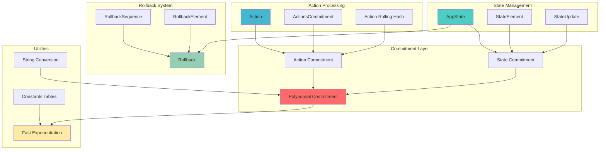
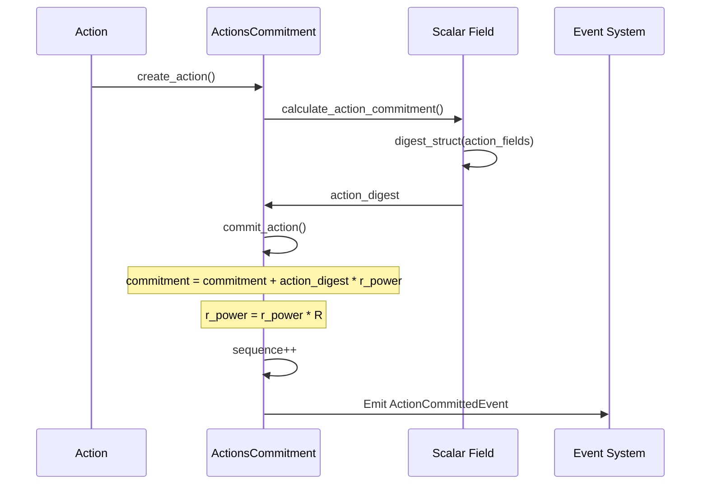
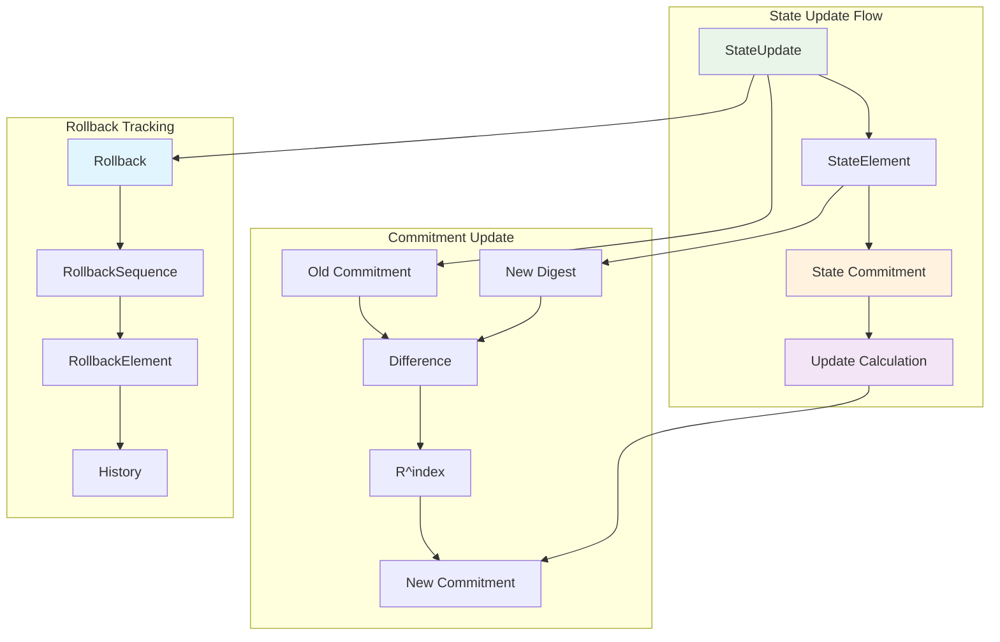
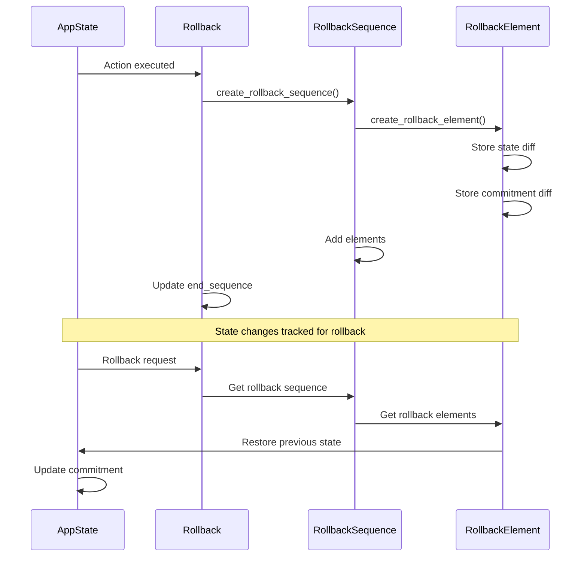
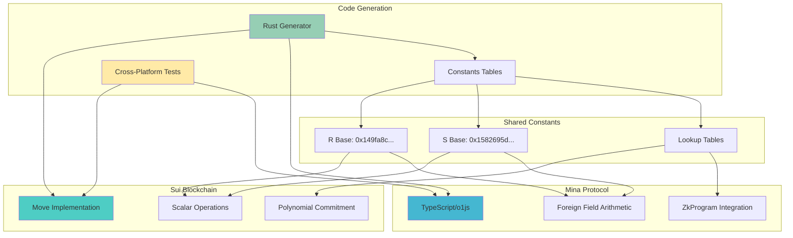
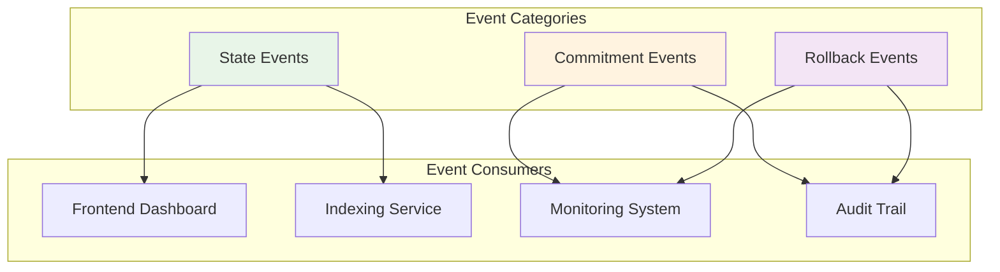

# Silvana Commitment System

## Polynomial Commitments for Efficient On-Chain State Management

---

## 1: System Overview

The Silvana commitment system implements a polynomial commitment scheme for efficient on-chain state management, designed to provide a single deterministic commitment that represents entire application states with minimal update costs. Built on Sui blockchain using Move language with BLS12-381 scalar field arithmetic.

**Key Components:**

- **Polynomial Commitments**: Single scalar values representing entire state vectors
- **Action Commitments**: Rolling hash system for action sequence integrity
- **State Management**: Efficient state updates with O(1) commitment recalculation
- **Rollback System**: State history tracking and rollback capabilities
- **Optimized Exponentiation**: Precomputed lookup tables for fast R^k calculations
- **String Encoding**: Mina-compatible string to field element conversion



---

## 2: Polynomial Commitment Theory

### The Mathematical Foundation

The commitment system uses polynomial evaluation over the BLS12-381 scalar field to create binding commitments. For a state vector `[v₀, v₁, ..., vₙ₋₁]`, we construct a polynomial:

```
f(x) = v₀ + v₁·x + v₂·x² + ... + vₙ₋₁·xⁿ⁻¹
```

The commitment is computed as `C = f(R)` where `R` is a fixed random field element.

### Key Properties

- **Binding**: Computationally infeasible to find different states with same commitment
- **Homomorphic**: Commitments can be combined additively
- **Efficient Updates**: Single element changes require O(1) operations
- **Deterministic**: Same state always produces same commitment

### Commitment Calculation

```rust
/// Inner struct digest: combines fields using base S
pub fn digest_struct(fields: &vector<Element<Scalar>>): Element<Scalar> {
    let mut d = scalar_zero();
    let s = get_s();
    for field in fields {
        d = scalar_add(&scalar_mul(&d, &s), field);
    }
    d
}

/// Outer table commitment: combines digests using base R
pub fn commit(table: &vector<Element<Scalar>>): Element<Scalar> {
    let mut acc = scalar_zero();
    let r = get_r();
    // Reverse iteration: table[i] gets coefficient r^i
    for i in reverse(0..table.length()) {
        acc = scalar_add(&scalar_mul(&acc, &r), &table[i]);
    }
    acc
}
```

---

## 3: Core Data Structures

### AppState Structure

```rust
pub struct AppState {
    id: UID,
    sequence: u64,
    actions_commitment: ActionsCommitment,
    state_elements_length: u32,
    state: ObjectTable<u32, StateElement>,
    state_commitment: Element<Scalar>,
    rollback: Rollback,
}
```

### StateElement Structure

```rust
pub struct StateElement {
    id: UID,
    state: vector<u256>,
}
```

### Action Structure

```rust
pub struct Action {
    action: String,                    // Action type (max 30 chars)
    action_data: vector<u256>,         // Action parameters
}
```

### ActionsCommitment Structure

```rust
pub struct ActionsCommitment {
    id: UID,
    sequence: u64,
    r_power: Element<Scalar>,          // Current R^sequence
    commitment: Element<Scalar>,       // Rolling commitment
}
```

---

## 4: Action Commitment System

### Rolling Hash Implementation

The action commitment system implements a rolling hash using polynomial evaluation:

```
commitment = action₀·R^(n-1) + action₁·R^(n-2) + ... + actionₙ₋₁·R^0
```

This preserves both action content and sequence order.

### Action Processing Flow



### Advantages Over Hash Chains

- **Field Arithmetic**: Extremely efficient in SNARK circuits
- **Homomorphic**: Supports algebraic operations
- **Incremental**: O(1) updates vs O(log n) for Merkle trees
- **Deterministic**: Same sequence always produces same commitment

---

## 5: State Management Architecture

### State Update Process



### Efficient State Updates

For a single state element change at index `i`:

```rust
pub fn update(
    old_table_commitment: &Element<Scalar>,
    old_struct_digest: &Element<Scalar>,
    new_struct_digest: &Element<Scalar>,
    index: u32,
): Element<Scalar> {
    let r_pow_i = r_scalar_pow(index);
    let struct_delta = scalar_sub(new_struct_digest, old_struct_digest);
    let table_delta = scalar_mul(&struct_delta, &r_pow_i);
    scalar_add(old_table_commitment, &table_delta)
}
```

**Time Complexity**: O(1) per update
**Space Complexity**: O(n) for n state elements

---

## 6: Rollback System

### Rollback Architecture

```rust
pub struct Rollback {
    id: UID,
    start_sequence: u64,
    traced_sequence: u64,
    end_sequence: u64,
    rollback_sequences: ObjectTable<u64, RollbackSequence>,
}

pub struct RollbackSequence {
    id: UID,
    sequence: u64,
    action: Action,
    elements: vector<RollbackElement>,
}

pub struct RollbackElement {
    index: u32,
    previous_state: vector<u256>,
    new_state: vector<u256>,
    commitment_before: Element<Scalar>,
    commitment_after: Element<Scalar>,
}
```

### Rollback Flow



### Rollback Features

- **Granular Tracking**: Individual state element changes
- **Commitment History**: Both before and after commitments stored
- **Sequence Management**: Configurable rollback depth
- **Efficient Purging**: Remove old rollback data to save space

---

## 7: Optimized Exponentiation

### Fast R^k Computation

The system uses precomputed lookup tables for efficient exponentiation:

```rust
/// Computes R^exp using base-1024 decomposition
/// exp = i₀ + 1024·i₁ + 1024²·i₂
/// R^exp = TABLE₂[i₂] × TABLE₁[i₁] × TABLE₀[i₀]
pub fn r_scalar_pow(exp: u32): Element<Scalar> {
    let i0 = exp & 0x3FF;           // exp mod 1024
    let i1 = (exp >> 10) & 0x3FF;   // next 10 bits
    let i2 = (exp >> 20) & 0x3FF;   // highest 10 bits

    let t0 = get_table0_entry(i0);
    let t1 = get_table1_entry(i1);
    let t2 = get_table2_entry(i2);

    scalar_mul(&scalar_mul(&t2, &t1), &t0)
}
```

### Performance Characteristics

- **Time Complexity**: O(1) - constant time with 3 lookups + 2 multiplications
- **Space Complexity**: 96 KiB for all precomputed tables
- **Range**: Supports exponents up to 1,073,741,823 (2³⁰ - 1)
- **Efficiency**: ~1000x faster than naive repeated multiplication

---

## 8: String Encoding System

### Mina-Compatible String Conversion

The system implements Mina protocol's string encoding for cross-chain compatibility:

```rust
/// Converts string to field element using Mina encoding
pub fn string_to_field(text: String): u256 {
    let text_bytes = text.as_bytes();
    let mut field: u256 = 0;
    let mut bit_position = 0;

    // Pack bytes in little-endian order
    for byte in text_bytes {
        field = field | (byte << bit_position);
        bit_position = bit_position + 8;
    }

    // Add STOP byte (0x01) for invertibility
    field = field | (1u256 << bit_position);

    assert!(field < MINA_PRIME, EInvalidField);
    field
}
```

### String Encoding Features

- **Mina Compatibility**: Uses same encoding as Mina protocol
- **Invertible**: STOP byte ensures unique decoding
- **Efficient**: Direct bit packing without padding
- **Validated**: Ensures result fits in Mina field

---

## 9: Security Considerations

### Commitment Security Model

**Binding Property**:

- Relies on discrete logarithm hardness in BLS12-381
- Computationally infeasible to find collisions with different states
- Security equivalent to ~128-bit symmetric encryption

**Collision Resistance**:

- Polynomial commitments are not hash-collision resistant
- Algebraic structure allows theoretical collision construction
- Mitigated by large scalar size (256 bits), random bases, calculating two commitments (for actions and state), using signatures or hash in the action data, and using MerkleTree inside o1js ZkProgram

---

## 10: Cross-Platform Mina Integration

### Actual Implementation Architecture

The Silvana commitment system features a **production-ready cross-platform implementation** that works seamlessly between Sui (Move) and Mina (o1js). The system is implemented in three components:

- **Move Implementation**: Native Sui blockchain polynomial commitments
- **TypeScript/o1js Implementation**: Mina ZkProgram-compatible version
- **Rust Code Generation**: Automated constant generation for both platforms



### TypeScript/o1js Implementation

**Package**: `@silvana-one/commitment` (internal)
**Dependencies**: `o1js ^2.7.0`, `@silvana-one/mina-utils ^1.0.23`

```typescript
import { ZkProgram, Field, UInt32 } from "o1js";
import {
  scalar,
  digestStruct,
  commit,
  update,
  CommitmentProgram,
} from "./commitment.js";

// Same mathematical operations as Move implementation
const struct1 = [scalar(1n), scalar(2n)];
const struct2 = [scalar(3n), scalar(4n)];

const c0 = digestStruct(struct1);
const c1 = digestStruct(struct2);
const commitment = commit([c0, c1]);

// Cross-platform verified: produces identical results to Move
console.log(commitment.toBigInt().toString(16));
// Output: 67c9d15a9ca6783200ae2bc0fe16bac805cf4abb8f79452334fd264669260e4b
```

### ZkProgram Integration

The system includes production ZkPrograms for proving commitment operations:

```typescript
export const CommitmentProgram = ZkProgram({
  name: "commitment",
  publicInput: AlmostReducedElement,
  publicOutput: AlmostReducedElement,
  methods: {
    // Prove a single commitment update
    updateCommitment: {
      privateInputs: [AlmostReducedElement, AlmostReducedElement, UInt32],
      async method(
        oldTableCommitment: AlmostReducedElement,
        oldStructDigest: AlmostReducedElement,
        newStructDigest: AlmostReducedElement,
        index: UInt32
      ) {
        // Verify update calculation inside circuit
        const rPowI = rScalarPowProvable(index);
        const structDelta = newStructDigest.sub(oldStructDigest);
        const tableDelta = structDelta.mul(rPowI);
        const newCommitment = oldTableCommitment.add(tableDelta);
        return newCommitment;
      },
    },

    // Prove struct digest calculation
    digestStructs: {
      privateInputs: [Provable.Array(CanonicalElement, 8)],
      async method(struct1: CanonicalElement[], struct2: CanonicalElement[]) {
        const digest1 = digestStructProvable(struct1);
        const digest2 = digestStructProvable(struct2);
        return [digest1, digest2];
      },
    },
  },
});
```

### Cross-Platform Verification

**Automated Testing**: The system includes comprehensive cross-platform verification:

```typescript
// Known test vectors verified between Move and TypeScript
const knownValues = [
  {
    index: 10,
    expected:
      "0x28b5085e0883923a5fe9bf9d108f8be3a432bd97156020d87dfce14ca429a152",
  },
  {
    index: 1000,
    expected:
      "0x0a371b0d2bfc4852d08ee7fa75734e1bcddac0b1386718e2bf1c37947dda1af4",
  },
  {
    index: 1024,
    expected:
      "0x38d6066e4e230849541ab04bfcd0e0641952328eeeaa833da7bef93814e0e427",
  },
];

// Cross-platform test passes: ✅ Perfect cross-platform consistency!
```

### Rust Code Generation

**Automated Constant Generation**: The system uses Rust to generate identical lookup tables for both platforms:

```rust
/// Generate TABLE0: R^i for i = 0..1023
fn generate_table0(r: &BigUint, modulus: &BigUint) -> Vec<String> {
    (0..1024)
        .map(|i| {
            let power = BigUint::from(i);
            let result = mod_pow(r, &power, modulus);
            to_move_hex(&result)
        })
        .collect()
}

/// Generates both Move and TypeScript constants
/// - constants.move: 3,138 lines of precomputed values
/// - constants.ts: 3,136 lines of identical TypeScript constants
pub fn main() {
    let table0 = generate_table0(&r, &modulus);
    let table1 = generate_table1(&r, &modulus);
    let table2 = generate_table2(&r, &modulus);

    generate_constants_move_file(&table0, &table1, &table2);
    generate_constants_typescript_file(&table0, &table1, &table2);
}
```

### Foreign Field Arithmetic

The TypeScript implementation uses o1js foreign field arithmetic for BLS12-381 compatibility:

```typescript
// BLS12-381 scalar field support
const BLS_FR =
  0x73eda753299d7d483339d80809a1d80553bda402fffe5bfeffffffff00000001n;
const Fr = createForeignField(BLS_FR);

export type CanonicalElement = InstanceType<typeof Fr.Canonical>;
export type AlmostReducedElement = InstanceType<typeof Fr.AlmostReduced>;

// Same base constants as Move implementation
export const R: CanonicalElement =
  Fr.from(0x149fa8c209ab655fd480a3aff7d16dc72b6a3943e4b95fcf7909f42d9c17a552n);

export const S: CanonicalElement =
  Fr.from(0x1582695da6689f26db7bb3eb32907ecd0ac3af032aefad31a069352705f0d459n);
```

### Merkle Tree Witnesses

**Advanced Feature**: The system includes Merkle tree witnesses for efficient proof verification:

- **Tree Structure**: Binary trees with 1024-element leaves
- **Witness Generation**: Automated witness computation for large indices
- **Proof Verification**: O(log n) verification with precomputed paths
- **Cache System**: FileSystem caching for compiled ZkPrograms

### Integration Examples

**Sui Move Integration**:

```rust
use commitment::polynomial::{digest_struct, commit, update};

let struct_fields = vector[scalar_from_u256(100), scalar_from_u256(200)];
let digest = digest_struct(struct_fields);
let commitment = commit(vector[digest]);
```

**Mina o1js Integration**:

```typescript
import { CommitmentProgram } from "./commitment.js";

const proof = await CommitmentProgram.updateCommitment(
  oldCommitment,
  oldDigest,
  newDigest,
  UInt32.from(42)
);

const isValid = await verify(proof, verificationKey);
console.log(`Proof valid: ${isValid}`); // true
```

### Development Workflow

**Cross-Platform Development Process**:

1. **Code Generation**: Run Rust generator to create constants
2. **Move Development**: Implement core logic in Move
3. **TypeScript Porting**: Mirror functionality in o1js
4. **Cross-Platform Testing**: Verify identical outputs
5. **ZkProgram Integration**: Add proving capabilities
6. **Performance Optimization**: Benchmark both implementations

**Test Commands**:

```bash
# Cross-platform verification
npm run test:cross-platform

# Large index ZkProgram test
npm run test:zkprogram-large

# Full test suite
npm run test:all
```

This production-ready implementation demonstrates that polynomial commitments can be effectively used across different blockchain ecosystems while maintaining mathematical consistency and performance.

---

## 11: Event System

### Comprehensive Event Tracking

**State Events**:

- `AppStateCreatedEvent` - New state initialization
- `StateElementUpdatedEvent` - Individual element changes
- `ActionCommittedEvent` - Action processing completion

**Commitment Events**:

- `ActionCommitmentCalculatedEvent` - Action digest calculation
- `ActionsCommitmentCreatedEvent` - Action commitment initialization

**Rollback Events**:

- `RollbackSequenceAddedEvent` - New rollback sequence
- `RecordsPurgedEvent` - Rollback history cleanup
- `TracedSequenceSetEvent` - Rollback tracking updates



---

## 12: Performance Characteristics

### Computational Complexity

| Operation         | Time Complexity | Space Complexity | Notes                    |
| ----------------- | --------------- | ---------------- | ------------------------ |
| State Commitment  | O(n)            | O(n)             | Full state calculation   |
| Single Update     | O(1)            | O(1)             | Using precomputed tables |
| Action Commitment | O(1)            | O(1)             | Rolling hash update      |
| Rollback Creation | O(k)            | O(k)             | k = changed elements     |
| Exponentiation    | O(1)            | O(1)             | Lookup table method      |

### Memory Usage

- **Precomputed Tables**: 96 KiB (3 × 1024 × 32 bytes)
- **State Elements**: ~32 bytes per element
- **Rollback History**: ~200 bytes per rollback element
- **Commitment Values**: 32 bytes each (BLS12-381 scalar)

---

## 13: API Reference

### Core Functions

#### Commitment Operations

```rust
pub fun digest_struct(fields: &vector<Element<Scalar>>): Element<Scalar>
pub fun commit(table: &vector<Element<Scalar>>): Element<Scalar>
pub fun update(old_commitment, old_digest, new_digest, index): Element<Scalar>
pub fun digest_fields(fields: &vector<u256>): Element<Scalar>
```

#### State Management

```rust
pub fun create_app_state(ctx: &mut TxContext): AppState
pub fun create_state_update(index: u32, new_state: vector<u256>): StateUpdate
pub fun get_state_commitment(app_state: &AppState): Element<Scalar>
pub fun update_state_element(app_state: &mut AppState, update: StateUpdate)
```

#### Action Processing

```rust
pub fun create_action(action: String, action_data: vector<u256>): Action
pub fun calculate_action_commitment(action: &Action): Element<Scalar>
pub fun commit_action(actions_commitment: &mut ActionsCommitment, action: &Element<Scalar>)
```

#### Rollback System

```rust
pub fun create_rollback(ctx: &mut TxContext): Rollback
pub fun add_rollback_sequence(rollback: &mut Rollback, sequence: u64, action: Action)
pub fun create_rollback_element(index: u32, previous_state, new_state): RollbackElement
pub fun purge_rollback_records(rollback: &mut Rollback, to_sequence: u64)
```

#### Utilities

```rust
pub fun r_scalar_pow(exp: u32): Element<Scalar>
pub fun string_to_field(text: String): u256
pub fun field_to_string(field: u256): String
pub fun scalar_from_u256(n: u256): Element<Scalar>
```

---

## 14: Usage Examples

### Basic State Management

```rust
// Create new app state
let mut app_state = create_app_state(ctx);

// Create action
let action = create_action(
    string::utf8(b"transfer"),
    vector[100, 200, 300]  // amount, from, to
);

// Calculate and commit action
let action_commitment = calculate_action_commitment(&action);
commit_action(&mut app_state.actions_commitment, &action_commitment);

// Update state element
let state_update = create_state_update(0, vector[500, 600]);
update_state_element(&mut app_state, state_update);
```

### Efficient Batch Updates

```rust
// Process multiple state updates efficiently
let mut old_commitment = get_state_commitment(&app_state);

for update in state_updates {
    let old_digest = get_state_element_digest(&app_state, update.index);
    let new_digest = digest_fields(&update.new_state);

    old_commitment = update(
        &old_commitment,
        &old_digest,
        &new_digest,
        update.index
    );
}

// Set final commitment
set_state_commitment(&mut app_state, old_commitment);
```

### Rollback Implementation

```rust
// Create rollback sequence
let mut rollback_sequence = create_rollback_sequence(
    sequence_number,
    action,
    ctx
);

// Track state changes
for state_change in changes {
    let rollback_element = create_rollback_element(
        state_change.index,
        state_change.previous_state,
        state_change.new_state,
        state_change.commitment_before,
        state_change.commitment_after
    );

    add_rollback_element(&mut rollback_sequence, rollback_element);
}

// Add to rollback system
add_rollback_sequence(&mut app_state.rollback, rollback_sequence);
```
