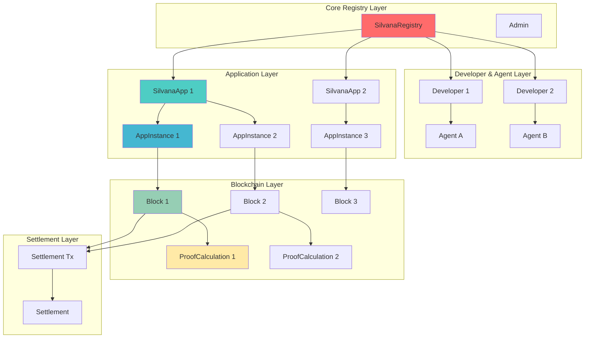
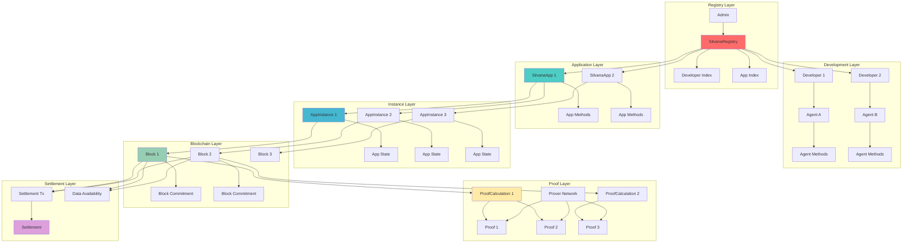
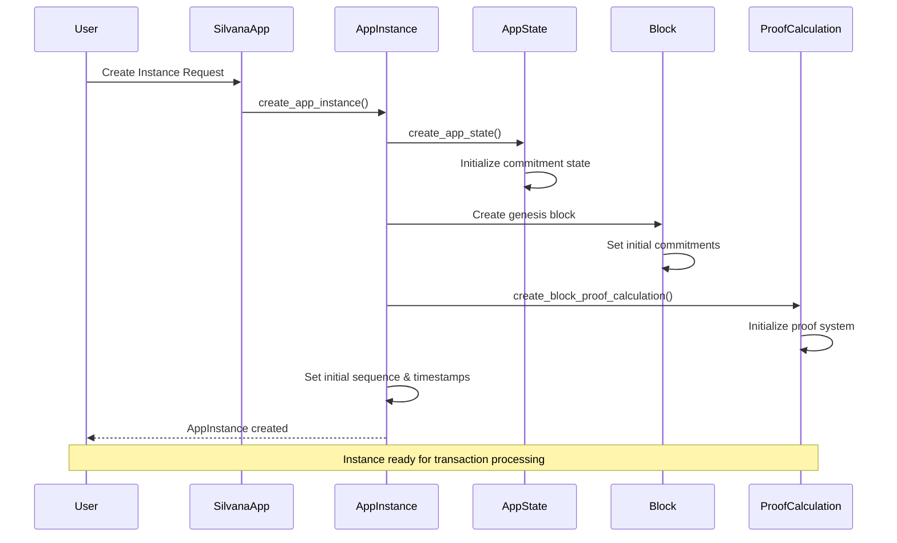
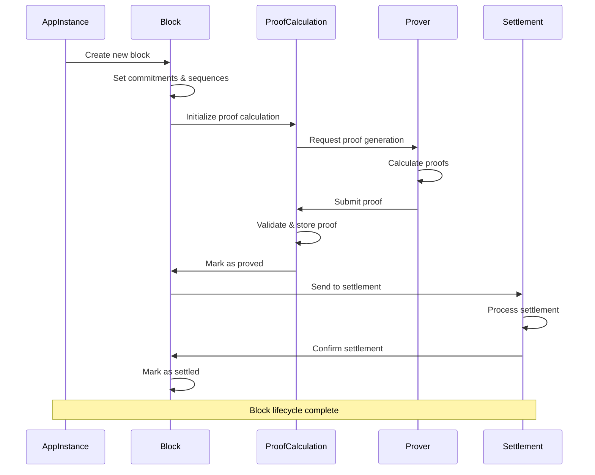
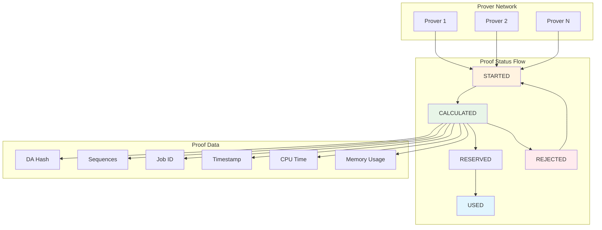
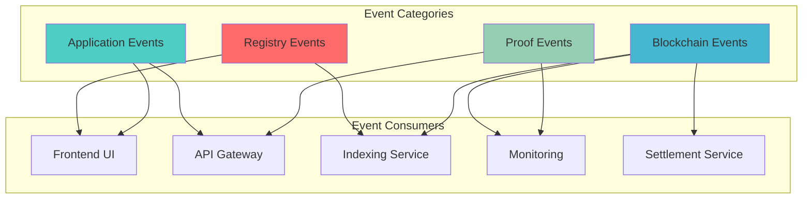
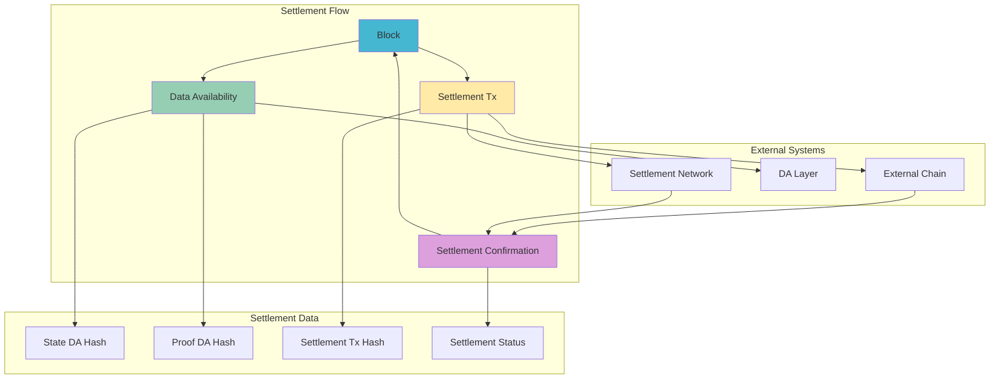
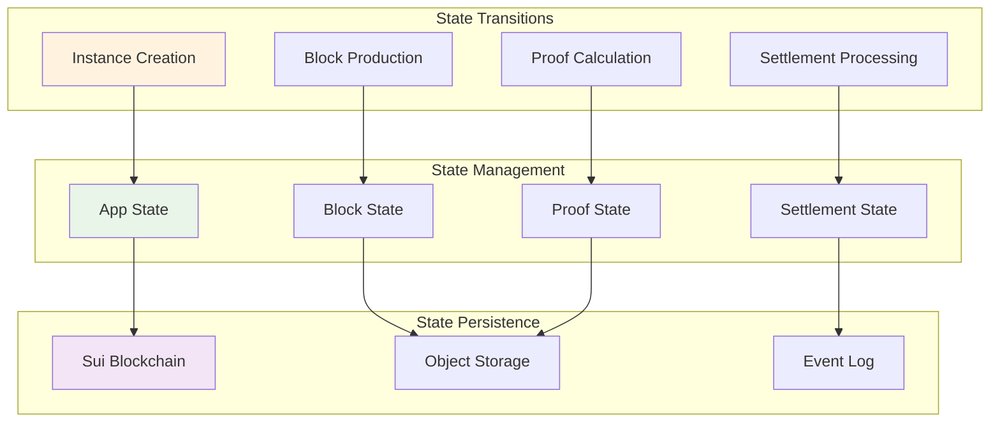

# Silvana Coordination Contracts

## Architecture & Code Flow Presentation

---

## 1: System Overview

The Silvana coordination system is a decentralized blockchain platform for managing AI agents, applications, and their execution with integrated proof calculation and settlement mechanisms, built on the Sui blockchain using Move language.

**Key Components:**

- **Registry**: Central orchestrator managing developers, agents, and Silvana applications
- **Developers**: Agent and application creators who publish AI solutions
- **Agents**: AI applications with execution methods and configurations
- **Silvana Apps**: Main application containers with methods and instances
- **App Instances**: Individual running instances with state management and block production
- **Blocks**: Blockchain blocks with commitments and settlement tracking
- **Provers**: Proof calculation system with distributed prover network
- **Settlement**: Cross-chain settlement integration (planned)



---

## 2: Enhanced Registry Structure

### SilvanaRegistry Structure

```rust
pub struct SilvanaRegistry {
    id: UID,
    name: String,
    version: u32,
    admin: address,
    developers: ObjectTable<String, Developer>,
    developers_index: ObjectTable<address, DeveloperNames>,
    apps: ObjectTable<String, SilvanaApp>,           // New: App management
    apps_index: ObjectTable<address, AppNames>,      // New: App indexing
}
```

### Developer Structure (Enhanced)

```rust
pub struct Developer {
    id: UID,
    name: String,
    github: String,
    image: Option<String>,
    description: Option<String>,
    site: Option<String>,
    agents: ObjectTable<String, Agent>,
    owner: address,
    created_at: u64,
    updated_at: u64,
    version: u64,
}
```

### Admin Structure

```rust
pub struct Admin {
    id: UID,
    address: address,
}
```

---

## 3: Application Architecture

### SilvanaApp Structure

```rust
pub struct SilvanaApp {
    id: UID,
    name: String,
    description: Option<String>,
    methods: VecMap<String, AppMethod>,
    owner: address,
    created_at: u64,
    updated_at: u64,
    version: u64,
    instances: VecSet<address>,                      // Track app instances
}
```

### AppMethod Structure

```rust
pub struct AppMethod {
    description: Option<String>,
    developer: String,
    agent: String,
    agent_method: String,
}
```

### AppInstance Structure

```rust
pub struct AppInstance {
    id: UID,
    silvana_app_name: String,
    description: Option<String>,
    metadata: Option<String>,
    methods: VecMap<String, AppMethod>,
    state: AppState,                                 // Commitment state
    blocks: ObjectTable<u64, Block>,                 // Block storage
    proof_calculations: ObjectTable<u64, ProofCalculation>,
    sequence: u64,
    admin: address,
    block_number: u64,
    previous_block_timestamp: u64,
    previous_block_last_sequence: u64,
    previous_block_actions_state: Element<Scalar>,
    last_proved_block_number: u64,
    last_proved_sequence: u64,
    isPaused: bool,
    created_at: u64,
    updated_at: u64,
}
```

---

## 4: Blockchain & Proof System

### Block Structure

```rust
pub struct Block {
    id: UID,
    name: String,
    block_number: u64,
    start_sequence: u64,
    end_sequence: u64,
    actions_commitment: Element<Scalar>,
    state_commitment: Element<Scalar>,
    time_since_last_block: u64,
    number_of_transactions: u64,
    start_actions_commitment: Element<Scalar>,
    end_actions_commitment: Element<Scalar>,
    state_data_availability: Option<String>,
    proof_data_availability: Option<String>,
    settlement_tx_hash: Option<String>,
    settlement_tx_included_in_block: bool,
    created_at: u64,
    state_calculated_at: Option<u64>,
    proved_at: Option<u64>,
    sent_to_settlement_at: Option<u64>,
    settled_at: Option<u64>,
}
```

### ProofCalculation Structure

```rust
pub struct ProofCalculation {
    id: UID,
    block_number: u64,
    start_sequence: u64,
    end_sequence: Option<u64>,
    proofs: VecMap<vector<u64>, Proof>,
    block_proof: Option<String>,
    is_finished: bool,
}
```

### Proof Structure

```rust
pub struct Proof {
    status: u8,                    // STARTED, CALCULATED, REJECTED, RESERVED, USED
    da_hash: Option<String>,
    sequence1: Option<vector<u64>>,
    sequence2: Option<vector<u64>>,
    rejected_count: u16,
    timestamp: u64,
    prover: address,
    user: Option<address>,
    job_id: String,
}
```

---

## 5: Complete System Architecture



---

## 6: Application Instance Creation Flow



**Key Steps:**

1. User requests instance creation from SilvanaApp
2. AppInstance is created with initial state and metadata
3. AppState is initialized with commitment tracking
4. Genesis block is created with initial commitments
5. ProofCalculation is set up for the first block
6. Instance is configured with sequence numbers and timestamps
7. Events are emitted for external systems

---

## 7: Block Production & Proof Flow



**Block Lifecycle:**

1. **Creation**: Block created with commitments and sequence ranges
2. **Proof Request**: ProofCalculation initialized for the block
3. **Proof Generation**: Distributed prover network generates proofs
4. **Proof Submission**: Provers submit proofs with verification data
5. **Validation**: Proof validation and status tracking
6. **Settlement**: Block data sent to settlement layer
7. **Confirmation**: Settlement confirmation and finalization

---

## 8: Proof Calculation System



**Proof Status Types:**

- **STARTED**: Proof calculation initiated by prover
- **CALCULATED**: Proof completed and submitted
- **REJECTED**: Proof rejected by validators
- **RESERVED**: Proof reserved for specific user
- **USED**: Proof utilized in block finalization

---

## 9: Enhanced Event System

### Registry Events

- `RegistryCreatedEvent` - New registry initialization
- `AdminCreateEvent` - Admin account creation

### Application Events

- `AppCreatedEvent` - New Silvana app creation
- `AppUpdatedEvent` - App modifications
- `AppDeletedEvent` - App removal
- `AppInstanceCreatedEvent` - Instance creation
- `AppMethodAddedEvent` - Method addition to app

### Blockchain Events

- `BlockEvent` - Block creation and commitment
- `DataAvailabilityEvent` - DA hash updates
- `SettlementTransactionEvent` - Settlement status

### Proof Events

- `ProofStartedEvent` - Proof calculation initiated
- `ProofSubmittedEvent` - Proof calculation completed
- `ProofUsedEvent` - Proof utilized
- `ProofReservedEvent` - Proof reserved
- `ProofRejectedEvent` - Proof rejected
- `BlockProofEvent` - Block proof finalization



---

## 10: Settlement Integration

### Settlement Components

- **Block Settlement**: Cross-chain settlement transaction management
- **Data Availability**: State and proof data availability tracking
- **Transaction Hashing**: Settlement transaction hash tracking
- **Settlement Confirmation**: Block settlement status confirmation



---

## 11: Key Functions & API Surface

### Registry Functions

- `create_registry()` - Initialize coordination system
- `add_developer()` - Register developer in system
- `add_agent()` - Create agent under developer
- `add_app()` - Create new Silvana application
- `get_app()` - Retrieve application information

### Application Functions

- `create_app()` - Initialize Silvana application
- `update_app()` - Modify application metadata
- `add_method()` - Add execution method to app
- `create_app_instance()` - Create app instance
- `delete_app()` - Remove application

### App Instance Functions

- `create_app_instance()` - Initialize app instance with state
- `add_method()` - Add method to instance
- `pause_instance()` - Pause instance execution
- `resume_instance()` - Resume instance execution
- `process_block()` - Process new block

### Block Functions

- `create_block()` - Create new block with commitments
- `set_state_calculated()` - Mark state as calculated
- `set_proved()` - Mark block as proved
- `set_settlement_data()` - Set settlement transaction data
- `set_settled()` - Mark block as settled

### Proof Functions

- `create_block_proof_calculation()` - Initialize proof calculation
- `start_proof()` - Start proof calculation
- `submit_proof()` - Submit calculated proof
- `reserve_proof()` - Reserve proof for user
- `use_proof()` - Utilize proof in block
- `reject_proof()` - Reject invalid proof

### Settlement Functions

- `send_to_settlement()` - Send block to settlement layer
- `confirm_settlement()` - Confirm settlement transaction
- `update_settlement_status()` - Update settlement status

---

## 12: Data Flow & State Management



**State Management Features:**

- **Commitment Tracking**: BLS12-381 scalar commitments for state and actions
- **Version Control**: Incremental version tracking across all components
- **Sequence Management**: Sequential transaction and block numbering
- **Timestamp Tracking**: Creation, update, and lifecycle timestamps
- **Status Monitoring**: Comprehensive status tracking across all components

---
